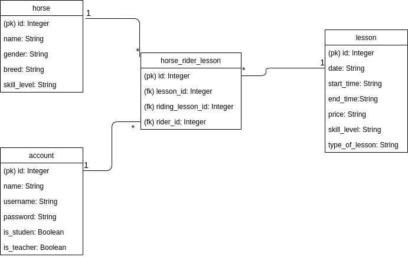

# Description of the database structure



## CREATE TABLE-statements of the database

```sql
CREATE TABLE lesson (
	id INTEGER NOT NULL, 
	date_created DATETIME, 
	date_modified DATETIME, 
	day VARCHAR(30) NOT NULL, 
	start_time VARCHAR(10) NOT NULL, 
	end_time VARCHAR(10) NOT NULL, 
	price VARCHAR(10) NOT NULL, 
	skill_level VARCHAR(144), 
	type_of_lesson VARCHAR(144), 
	PRIMARY KEY (id)
);
```

```sql
CREATE TABLE horse (
	id INTEGER NOT NULL, 
	date_created DATETIME, 
	date_modified DATETIME, 
	name VARCHAR(144) NOT NULL, 
	gender VARCHAR(10) NOT NULL, 
	breed VARCHAR(144), 
	skill_level VARCHAR(50) NOT NULL, 
	PRIMARY KEY (id)
);

```

```sql
CREATE TABLE account (
	id INTEGER NOT NULL, 
	date_created DATETIME, 
	date_modified DATETIME, 
	name VARCHAR(144) NOT NULL, 
	username VARCHAR(144) NOT NULL, 
	password VARCHAR(144) NOT NULL, 
	is_student BOOLEAN NOT NULL, 
	is_teacher BOOLEAN NOT NULL, 
	PRIMARY KEY (id), 
	CHECK (is_student IN (0, 1)), 
	CHECK (is_teacher IN (0, 1))
);

```

```sql
CREATE TABLE horse_rider_lesson (
	id INTEGER NOT NULL, 
	account_id INTEGER NOT NULL, 
	lesson_id INTEGER NOT NULL, 
	horse_id INTEGER, 
	PRIMARY KEY (id), 
	FOREIGN KEY(account_id) REFERENCES account (id), 
	FOREIGN KEY(lesson_id) REFERENCES lesson (id), 
	FOREIGN KEY(horse_id) REFERENCES horse (id)
);

```

